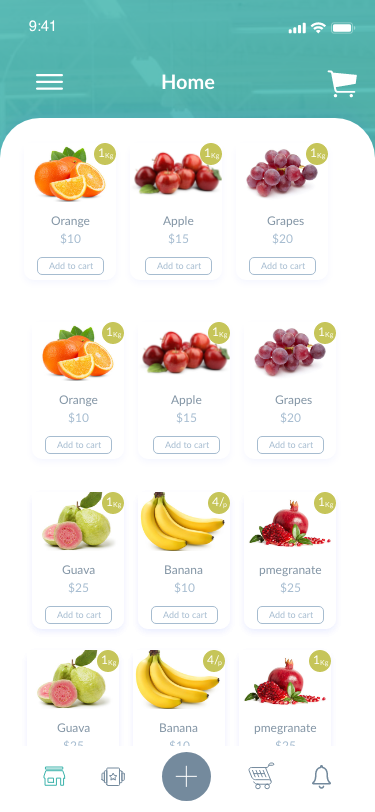

# Tienda de Conveniencia

Photo by <a href="https://unsplash.com/@robmaxwell?utm_source=unsplash&amp;utm_medium=referral&amp;utm_content=creditCopyText">Rob Maxwell</a> on <a href="https://unsplash.com/s/photos/grocery?utm_source=unsplash&amp;utm_medium=referral&amp;utm_content=creditCopyText">Unsplash</a>

## Pre-requisitos
-  React Native
   - Instalar el entorno de desarrollo [**:warning: utiliza la opción React Native CLI Quickstart NO utilizar Expo**](https://reactnative.dev/docs/environment-setup)
- Editor de texto
  - Elegir un editor para codificar, puede ser [Visual Studio Code](https://code.visualstudio.com/), o algúno similar.
  - Agregar la extensión [Prettier](https://marketplace.visualstudio.com/items?itemName=esbenp.prettier-vscode) para mantener un estilo consistente en tu código
  - Instalar [ESLint](https://eslint.org/) para ayudarte a encontrar y arreglar problemas de tu código
  - Agregar la extensión [Eslint](https://marketplace.visualstudio.com/items?itemName=dbaeumer.vscode-eslint) a tu editor para integrar la funcionalidad de Eslint
- Calidad de código. Para analizar la calidad de tu código necesitarás
  - Instalar y configurar [CodeClimate](https://codeclimate.com/) para analizar tu codigo y mejorar la calidad atendiendo los resultados del análisis
  
## Requerimientos funcionales
  
  Una tienda de conveniencia que se dedica a la comercialización de diferentes productos, como frutas y verduras, necesita una app móvil que le permita a sus clientes realizar pedidos. La aplicación deberá:
  - Permitir a los clientes registrarte
  - Permitir a los clientes registrados, iniciar sesión
  - Mostrar en la pantalla de inicio (Home) un listado de los productos disponibles
  - Mostrar un menú lateral con las siguientes opciones:
    - Home. Lleva a la pantalla de inicio
    - My orders. Lleva a la pantalla en donde muestra un listado de todas las ordenes que se han realizado
    - Offers. No hace nada
    - Notifications. No hace nada
    - Our Branches. No hace nada
    - Contact us. No hace nada
    - Feedback. No hace nada
    - Logout. Cierra la sesión
  - En la parte de abajo mostrará una barra con 5 opciones. De estas, solo la del carro de compras, y la de home serán funcionales, las otras 3 no realizarán ninguna función.
  - En la parte de arriba se mostrará un ícono mediante el cual el usuario podría ir a revisar su carro de compras.
 
 Los detalles de la información a mostrar en cada pantalla se muestran en el apartado de diseño.
     
## Requerimientos no-funcionales
- Base de datos
   - La información se guardará en firebase
 - Calidad
   - Utilizar un estilo de código estandarizado (revisado por Eslint)
   - Incluir pruebas unitarias
   - Puntuación **A** obtenida en CodeClimate
- Ejecución 
   - Puede ejecutarse en Android o iOs
- Diseño
   - Debe ser lo más cercano posible al proporcionado
- Código fuente
   - Orientado a Objetos
   - Métodos pequeños
   - Aplicar los principios [SOLID](https://blog.usejournal.com/how-to-apply-solid-principles-in-react-applications-6c964091a982)
 - Manejo del estado
   - Redux para el manejo del estado de la App

## Diseño

En la carpeta [img](/img) se encuentra el diseño solicitado en formato PNG y [Figma](https://www.figma.com/).

## Flujo de trabajo sugerido

- Divide tu trabajo en pequeñas tareas
- Para cada pantalla identifica o clasifica los diferentes compones que se presentan
- Inicia programando los componentes individuales procurando que estos sean reutilizables
- Una vez que tienes listos los componentes integra las pantallas.

## Entregable
- Código fuente en Github
- Incluir en el repositorio la puntuación obtenida (badge) en CodeClimate
- [Los commits deben se significativos](https://medium.com/better-programming/you-need-meaningful-commit-messages-d869e44e98d4)

## Recursos
[Para apoyo de tus actividades utiliza esta lista de recursos recomendados](https://github.com/bright-coders/commons/tree/master/topics/resources-react-native)
  
